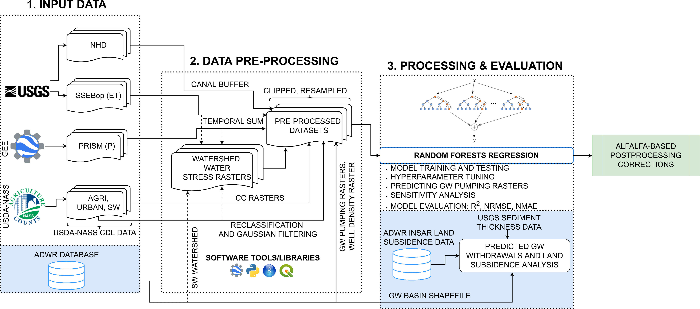

# Advancing Remote Sensing and Machine Learning-Driven Frameworks for Groundwater Withdrawal Estimation in Arizona: Linking Land Subsidence to Groundwater Withdrawals

## Abstract
Groundwater plays a crucial role in sustaining global food security but is being over-exploited in many basins of the world. Despite its importance and finite availability, local-scale monitoring of groundwater withdrawals required for sustainable water management practices is not carried out in most countries, including the United States. In this study, we combine publicly available datasets into a machine learning framework for estimating groundwater withdrawals over the state of Arizona. Here we include evapotranspiration, precipitation, crop coefficients, land use, annual discharge, well density, and watershed stress metrics for our predictions. We employ random forests to predict groundwater withdrawals from 2002-2020 at a 2 km spatial resolution using in-situ groundwater withdrawal data available for Arizona Active Management Areas (AMA) and Irrigation Non-Expansion Areas (INA) from 2002-2009 for training and 2010-2020 for validating the model respectively. The results show high training (R2≈ 0.9) and good testing (R2≈ 0.7) scores with normalized mean absolute error (NMAE) ≈ 0.62 and normalized root mean square error (NRMSE) ≈ 2.34 for the AMA/INA region. Using this method, we spatially extrapolate the existing groundwater withdrawal estimates to the entire state and observe the co-occurrence of both groundwater withdrawals and land subsidence in South-Central and Southern Arizona. Our model predicts groundwater withdrawals in regions where production wells are present on agricultural lands and subsidence is observed from Interferometric Synthetic Aperture Radar (InSAR), but withdrawals are not monitored. By performing a comparative analysis over these regions using the predicted groundwater withdrawals and InSAR-based land subsidence estimates, we observe a varying degree of subsidence for similar volumes of withdrawals in different basins. The performance of our model on validation datasets and its favorable comparison with independent water use proxies such as InSAR demonstrate the effectiveness and extensibility of our combined remote sensing and machine learning-based approach.



## Dependencies

[Anaconda](https://www.anaconda.com/products/individual) is required for installing the Python 3 packages. Once Anaconda
is installed, the following can be run from the command line to install the required packages.

```
conda env create -f environment.yml
```

We use [OSGeo4W](https://www.osgeo.org/projects/osgeo4w/) binary distribution for Windows and use system call from Python to generate rasters. For Linux or MacOS, gdal needs to be installed separately, and the appropriate 'gdal_path' needs to be set in Python_Files/gw_driver.py

## Publications
Hydrological Processes Paper: https://onlinelibrary.wiley.com/doi/10.1002/hyp.14757

AGU Fall Meeting 2020 Poster: https://bit.ly/3fz6a6y

Citation:
```
@article{https://doi.org/10.1002/hyp.14757,
author = {Majumdar, Sayantan and Smith, Ryan and Conway, Brian D. and Lakshmi, Venkataraman},
title = {Advancing Remote Sensing and Machine Learning-Driven Frameworks for Groundwater Withdrawal Estimation in Arizona: Linking Land Subsidence to Groundwater Withdrawals},
journal = {Hydrological Processes},
volume = {n/a},
number = {n/a},
pages = {e14757},
keywords = {groundwater hydrology, remote sensing, machine learning, land subsidence, InSAR, time series analysis, estimation and forecasting, geospatial},
doi = {https://doi.org/10.1002/hyp.14757},
url = {https://onlinelibrary.wiley.com/doi/abs/10.1002/hyp.14757},
eprint = {https://onlinelibrary.wiley.com/doi/pdf/10.1002/hyp.14757},
note = {e14757 HYP-21-0791.R2}
}
```

## Acknowlegments
We would like to acknowledge funding from the NASA Terrestrial Hydrology Program, Grant number 80NSSC21K0979. We are grateful to all the opensource software and data communities for making their resources publicly available and would like to acknowledge USGS (https://earlywarning.usgs.gov/ssebop/modis, https://www.usgs.gov/national-hydrography/access-national-hydrography-products), USDA (https://nassgeodata.gmu.edu/CropScape/), and the PRISM group (http://www.prism.oregonstate.edu/) for providing the required remote sensing products. We also thank the ADWR (https://infoshare.azwater.gov/docushare/dsweb/View/Collection-72) for providing the necessary data sets related to groundwater withdrawals, land subsidence, and other shapefiles used in this research. Finally, we would like to convey our gratitude to our colleagues and families for their continuous motivation and support. Any opinions, findings, conclusions, or recommendations expressed in this material are those of the authors and do not necessarily reflect the views of the funding agencies.

 &nbsp; 